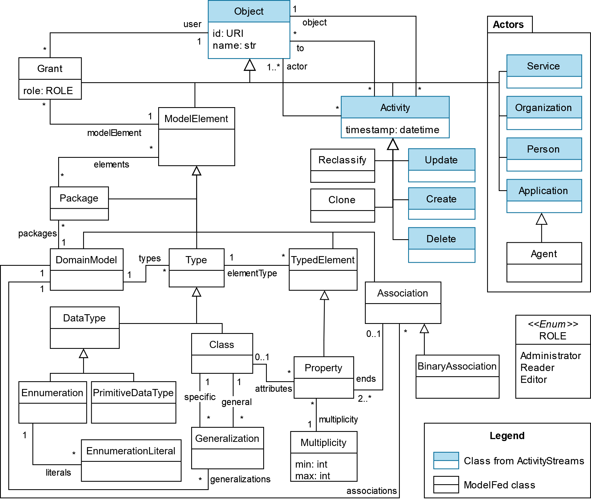

Objects
=======

The following diagram shows the concepts of the ModelFed vocabulary and their relationships.
*Objet* is the core concept of the :doc:`ModelFed vocabulary <vocabulary>`, defined in the
`Activity vocabulary <https://www.w3.org/TR/activitystreams-vocabulary/>`_ as an entity of
any kind. Every *Object, identified by a globally unique URI, falls into one of four main
categories (*ModelElements*, *Activities*, *Actors*, and *Grants*).

ModelElements
-------------
*ModelElement*, which inherits from Object, is an abstract concept that serves as a general
representation of any element within a model. The ModelFed vocabulary provides a pragmatic
representation of the UML specification for structural models. Concepts such as *Classes*,
*Enumerations*, *Associations*, and *Generalizations* can be defined to build a domain model.
As an example, the following JSON-LD defines a class named *ProductPassport* with a string
attribute (*name*). Note that every object includes an *id* for global identification and
a *type* for object classification.

.. code-block:: json

    {
    "@context": [
        "https://www.w3.org/ns/activitystreams",
        "https://www.modelfed.com/ns/modelfed"
    ],
    "type": "Class",
    "id": "https://platformA.com/classes/product_passport",
    "name": "ProductPassport",
    "attributes": [
        {
        "type": "Property",
        "id": "https://platformA.com/properties/name",
        "name": "name",
        "elementType": "str"
        }
    ]
    }

Activities
----------

*Activities* enable the specification of actions performed on any *Object*.
ModelFed defines five activities: *Create*, *Update*, *Delete*, *Reclassify*, and *Clone*.

The following is the definition of an Activity to create the *LifecicleStage* class. It includes:

- ``@context`` to define the vocabulary used in the JSON-LD document.
- ``type`` to define the type of activity (in this case, *Create*).
- ``id`` to define the globally unique identifier of the activity.
- ``actor`` to define the actor who performed the activity.
- ``to`` to define the actors with whom the activity is federated.
- ``object`` to define the object on which the activity is performed (the *LifecicleStage* class with the *start* attribute).
- ``timestamp`` to define the date and time of the activity.

.. code-block:: json

    {
    "@context": [
        "https://www.w3.org/ns/activitystreams",
        "https://www.modelverse.com/ns/modelverse"
    ],
    "type": "Create",
    "id": "http://platformA.com/activities/a1c2t3",
    "actor": "https://platformC.com/industrialeng/",
    "to": [
        "http://platformA.com/admin/"
    ],
    "object": {
        "type": "LifecicleStage",
        "id": "https://platformC.com/classes/life_cicle_stage",
        "name": "LifecicleStage",
        "attributes": [
            {
            "type": "Property",
            "id": "https://platformC.com/properties/lf_start",
            "name": "start",
            "elementType": "date"
            }
        ]
        "owner": "https://platformA.com/domain_model/dpp_model"
    },
    "timestamp": "2025-02-11T15:42:45Z"
    }

Actors
------

Grants
------