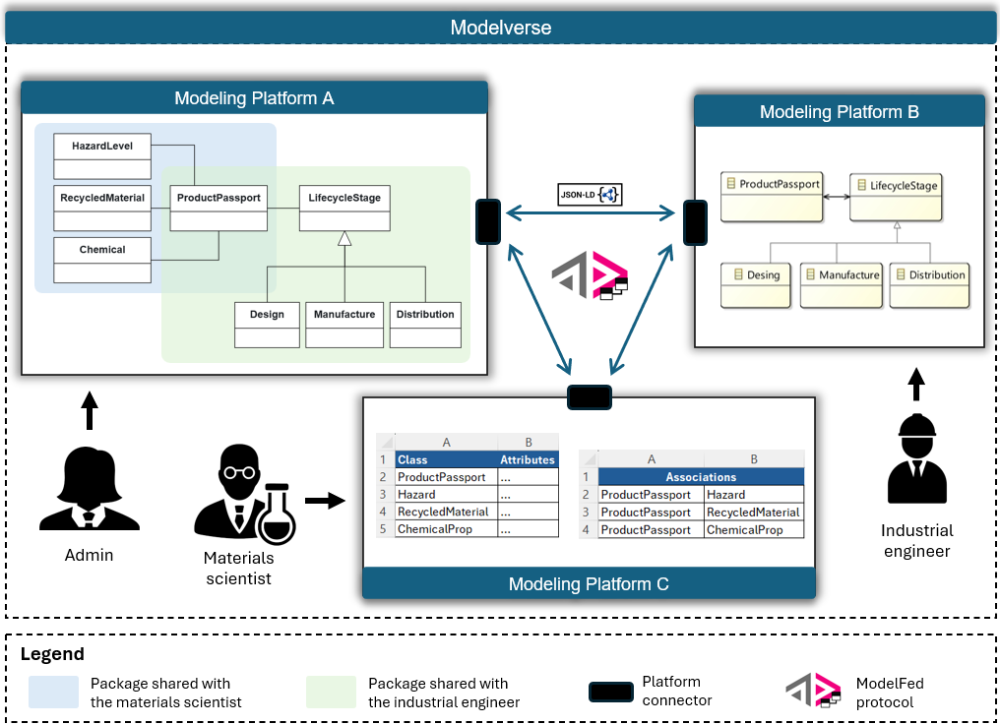

Overview
========

ModelFed is a protocol that enables **federated modeling activities** in collaborative environments involving 
multiple users (referred to as *actors*) and modeling platforms. It allows actors to create, modify, and share models 
with others through a structured set of activities defined in **JSON-LD** format.

For example, ModelFed can support scenarios such as a collaborative modeling environment for the
`Digital Product Passport (DPP) <https://data.europa.eu/en/news-events/news/eus-digital-product-passport-advancing-transparency-and-sustainability>`_ domain,
where different experts contribute to a shared model from different modeling platforms.
Each user can focus their expertise on a specific aspect of the model, while the admin user can
manage the overall process and ensure that all actors have the necessary permissions to access
and modify the model elements.

Similar to `ActivityPub <https://www.w3.org/TR/activitypub/>`_, in ModelFed each actor must have
a user account on a platform server and expose two endpoints:

- An outbox, used to send activities to other actors
- An inbox, used to receive activities from others

Both endpoints should accept HTTP POST requests and are essential for enabling asynchronous, federated
collaboration between users across different modeling platforms.
