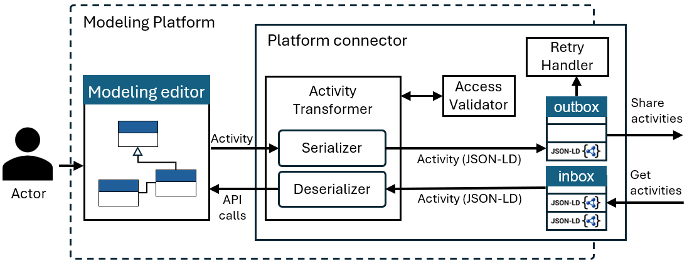
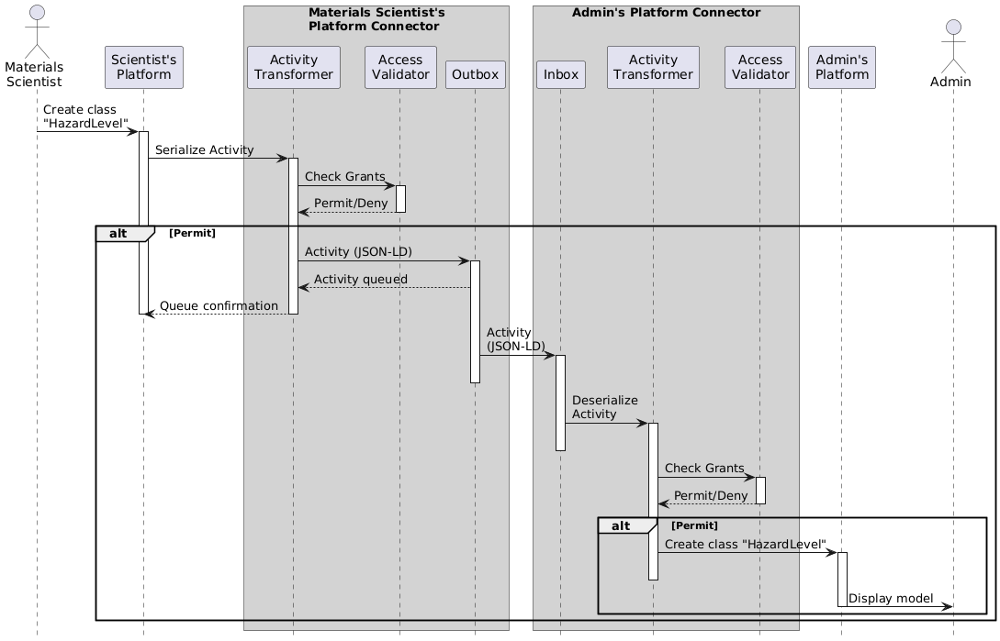

Server-to-Server Interaction
============================

In Modelverse, **server-to-server interaction** is key to enabling collaborative modeling across different platforms. 
This is handled by the **Platform Connector**, which acts like a translator and traffic manager 
between systems to keeping data and modeling activities in sync both ways.

Whether you're pushing changes from one modeling tool or pulling updates from another, the Platform Connector ensures that 
these interactions happen reliably.

See the following figure for a visual overview on the main components of the Platform Connector should implement to enable
federated modeling activities:

Inbox & Outbox
--------------

At the heart of the connector are the ``inbox`` and ``outbox``: two RESTful endpoints that handle incoming and outgoing activities.

- The **inbox** listens for ModelFed activities in JSON-LD format.
- The **outbox** queues up any activities that need to be sent to other platforms in the federation.

Activity Transformer
--------------------

The Activity Transformer consists of two main components:

- The **Serializer**: Takes platform-specific events/activities and converts them into ModelFed-compliant activities. That includes mapping them to the right vocabulary terms, tagging them with metadata (like who did it and when), and outputting valid JSON-LD using the ModelFed ``@context``.

- The **Deserializer**: Does the reverse, takes incoming JSON-LD activities, resolves their context, and turns them into platform-specific API calls to reproduce the original action/activity.

Access Validator
----------------

Security matters, so before anything gets serialized or deserialized, we run it through the **Access Validator**. This component checks whether the actor (user) has the proper permissions based on their roles.

For example, editors might be allowed to create or update elements, but not delete them. If the action is not authorized, it is rejected by the system.

Retry Handler (Optional)
------------------------

To improve reliability, the Platform Connector may include an optional **Retry Handler** component for managing delivery failures.

- Failed activities are placed in a retry queue and reattempted using an exponential backoff strategy, for example, beginning at 1 second and increasing up to a maximum of 5 hours.
- If delivery remains unsuccessful after a predefined number of attempts (e.g., 24 retries), the system logs the failure and notifies the user or administrator.

This fault-tolerant mechanism follows established patterns in distributed systems to ensure robust message delivery.

Activity Federation Example
---------------------------

To illustrate the activity federation process and the key components involved, the following presents a sequence diagram.
In this scenario, the user *Admin* has already created a domain model and granted editor permissions to the *Materials Scientist*.

The following steps outline how the *HazardLevel* class creation is federated across platforms:

1. **Local Action Initiation**

   - The *Materials Scientist* creates a new class named *HazardLevel* within their modeling environment.

2. **Serialization on the Sender Side**

   - This event triggers the platform to send the activity to the **Activity Transformer**.
   - The transformer first delegates the request to the **Access Validator**, which checks:
        - Whether the actor has the necessary *Grants* for the model element (*HazardLevel* or its parent model).
        - Whether the actor is allowed to perform the requested operation (*Create*).

   - If validation is successful:
        - The activity is serialized using the ModelFed JSON-LD format.
        - It is then added to the **Outbox** for asynchronous delivery to other platforms.

3. **Asynchronous Federation**

   - The activity is transmitted without blocking the user interface, allowing the *Materials Scientist* to continue working without interruption.

4. **Deserialization on the Recipient Side**

   - On the *Admin* platform, the activity is received via the **Inbox**.
   - It is passed to the **Activity Transformer** for deserialization.

5. **Second Authorization Check**

   - Before deserialization, the recipient server performs a second access validation:
        - This ensures that the activity is not only valid from the sender’s side, but also acceptable in the receiving context.

6. **Execution**

   - If the activity passes this second check:
        - The platform replicates the action using platform-specific API calls.
        - As a result, *Admin* sees the updated model including the newly created *HazardLevel* class.
