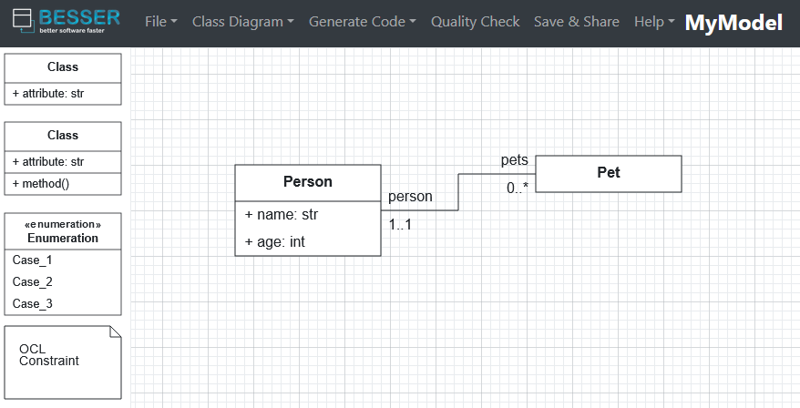

# ModelFed Prototype

This prototype is a proof of concept that implements the **ModelFed protocol** to federate models between two modeling platforms: the [BESSER platform](https://github.com/BESSER-PEARL/BESSER) and the [PyEcore platform](https://github.com/pyecore/pyecore).


## Deploy the prototype

**Requirements:**
- Python 3.10 or higher

We recommend creating a virtual environment using [venv](https://docs.python.org/3/tutorial/venv.html) or [conda](https://docs.conda.io/en/latest/).

Install the dependencies:

```bash
$ pip install -r requirements.txt
```

This prototype runs a web server using [FastAPI](https://fastapi.tiangolo.com/). To start a server, run `main.py` with the necessary parameters. For example:

```bash
$ python main.py --platform=besser --port=8000
```

- `--platform`: Choose the modeling platform ()`besser` or `pyEcore`)
- `--port`: Specify the port the server should run on

## Example Usage

### Deploy two servers

1. Start a PyEcore server on port 8000:

```bash
$ python main.py --platform=pyEcore --port=8000
```

2. Start a BESSER server on port 8001:

```bash
$ python main.py --platform=besser --port=8001
```

### Simulate Modeling Activities

Run the following scripts to simulate modeling actions performed by `userA` on the PyEcore server. These actions will be federated to `userB` on the BESSER server.

    $ python examples/create_domain_model.py
    $ python examples/create_pet_class.py
    $ python examples/create_person_class.py
    $ python examples/create_association.py

you can review the list of `userB` activities (inbox and outbox) at [http://localhost:8001/userB/activities]

### Download the Resulting Model

Download the final federated model received by `userB`:

    $ python examples/download_model.py

The generated BESSER model will be saved in: [model_test/example_model.py](model_test/example_model.py)

### Visualize the Model

You can import the generated model into the [BESSER modeling editor](https://editor.besser-pearl.org/) to get a graphical representation like this:

<div align="center">
  
</div>