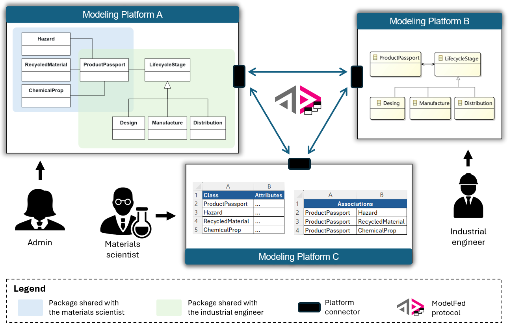
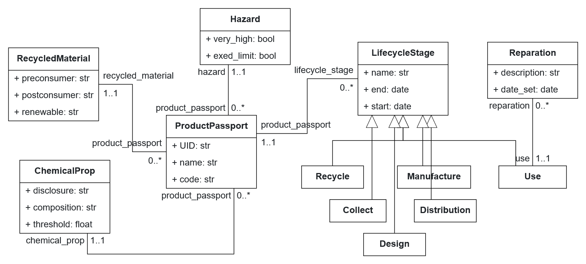

# Validation experiment 1

This validation exercise consists of executing 50 JSON-based modeling activities by three different users:

- The *Admin*, who creates the domain model, defines packages, and grants access to other users (interacting through the BESSER platform).
- The *Materials Scientist*, who defines aspects of the model related to material composition and hazardous substances (using the PyEcore platform).
- The *Industrial Engineer*, who models the product life cycle stages (also using the PyEcore platform).

The following figure illustrates the scenario:

<div align="center">
  
</div>

## Running the Experiment

To execute the test, deploy three servers (one for each user) using the ModelFed prototype:

```bash
python main.py --platform=besser --port=8000
python main.py --platform=pyEcore --port=8001
python main.py --platform=pyEcore --port=8003
```

Then run the activities to simulate the collaborative modeling process:

    $ python run_activities.py --scenario=1 --data=activities.json --scenarios=scenarios.json

- `--scenario`: Selects the execution order of user activities. We have pre-configured 8 different orders to test consistency. All scenarios should produce the same final model.

- `--data`: Specifies the file containing the JSON-LD modeling activities.

- `--scenarios`: Defines the file that maps user roles to execution orders.

## Downloading the Resulting Model

After the activities have been executed, download the resulting model using:

    $ python download_model.py

The model will be saved in: [prototype/output_model/dpp_besser_model.py](/output_model/dpp_besser_model.py)

### 📊 Results

You can import the generated model (`dpp_besser_model.py`) into the [BESSER modeling editor](https://editor.besser-pearl.org/) to get a graphical representation like this:

<div align="center">
  
</div>